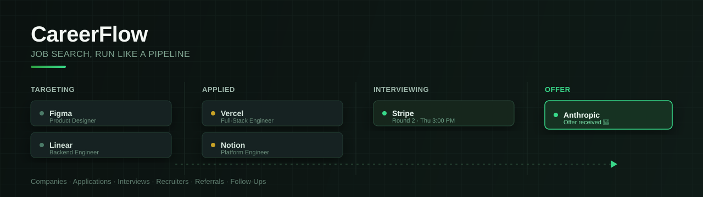
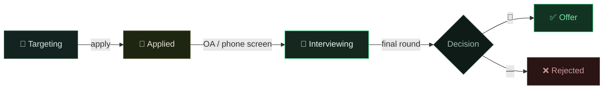
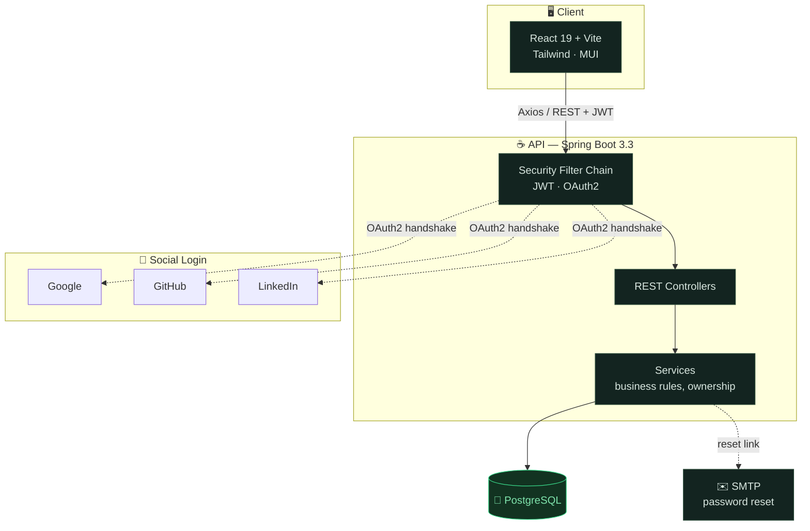

<div align="center">



<br><br>

<p>
  <a href="https://github.com/VKGarg7/CareerFlow/actions/workflows/ci.yml"></a>
  
  
  
  
  
</p>

### 🌐 [**Launch the live app**](https://career-flow-chi.vercel.app/) &nbsp;·&nbsp; 📘 [API docs](https://careerflow-backend-ravi.onrender.com/swagger-ui/index.html)

<sub>Backend sleeps after inactivity on Render's free tier — first request may take ~30s to wake it.</sub>

<br>

[Features](#-features) · [Tech Stack](#-tech-stack) · [Getting Started](#-getting-started) · [Testing](#-testing) · [API](#-api-overview) · [Deployment](#️-deployment)

</div>

<br>

---

## 📖 Overview

Job hunting is a pipeline, not a to-do list — a lead has to move through **targeting → applied → interviewing → offer** before it means anything, and most people track that with a spreadsheet that rots after week two.

CareerFlow treats the search itself like a system: every company is a stage, every application a state machine, every recruiter thread and follow-up a node that either advances or goes stale. One dashboard, real-time status, nothing falls through the cracks.



---

## ✨ Features

#### The pipeline

<table>
<tr>
<td width="25%" valign="top">

**🏢 Company Tracking**
Full pipeline: `Targeting → Applied → Interviewing → Offer / Rejected`

</td>
<td width="25%" valign="top">

**📝 Applications**
Granular statuses (`OA Scheduled`, `Interview Cleared`, `Offer Received`) + source (`LinkedIn`, `Referral`, `Naukri`)

</td>
<td width="25%" valign="top">

**🎤 Interviews**
Every round logged with timelines, notes, and outcomes

</td>
<td width="25%" valign="top">

**⏰ Follow-Ups**
Nothing pending goes unnoticed

</td>
</tr>
</table>

#### The network

<table>
<tr>
<td width="33%" valign="top">

**🤝 Recruiters**
Track every recruiter conversation and its status

</td>
<td width="33%" valign="top">

**🔗 Referrals**
Log referral requests and outcomes

</td>
<td width="33%" valign="top">

**👤 Profile**
Education, experience, projects, resume & cover letters

</td>
</tr>
</table>

#### Underneath it all

| | |
|---|---|
| 🔐 **Auth** | JWT + Google / GitHub / LinkedIn OAuth2, BCrypt hashing, token blacklisting on logout, email-based password reset |
| 📊 **Dashboard** | At-a-glance summary of your entire search |
| 📁 **Document Storage** | Upload and retrieve resumes & cover letters |
| 🕓 **Activity Log** | Full audit trail across the platform |
| 🛠️ **Admin Dashboard** | Role-based access, user management, system health monitoring |
| ♻️ **Soft Deletes** | Nothing is permanently lost — everything's recoverable |

---

## 🧱 Tech Stack

<table>
<tr>
<td width="18%"><strong>Frontend</strong></td>
<td>


</td>
</tr>
<tr>
<td><strong>Backend</strong></td>
<td>


</td>
</tr>
<tr>
<td><strong>Data</strong></td>
<td>


</td>
</tr>
<tr>
<td><strong>Testing</strong></td>
<td>


</td>
</tr>
<tr>
<td><strong>Tooling</strong></td>
<td>


</td>
</tr>
</table>

<details>
<summary><strong>How the pieces fit together</strong></summary>
<br>



</details>

---

## 🗂️ Project Structure

```
CareerFlow/
├── backend/                          # Spring Boot application
│   └── src/main/java/com/careerflow/
│       ├── auth/                     # Login, signup, password reset
│       ├── user/                     # Profile & document management
│       ├── company/                  # Company tracking
│       ├── application/              # Job application tracking
│       ├── interview/                # Interview rounds, notes, outcomes
│       ├── recruiter/                # Recruiter contact management
│       ├── referral/                 # Referral tracking
│       ├── followup/                 # Follow-up reminders
│       ├── document/                 # File upload/download
│       ├── admin/                    # Admin dashboard & user management
│       ├── audit/                    # Audit logging
│       ├── config/                   # Security, JWT, OAuth2, CORS, Swagger, file storage
│       ├── common/                   # Base entities, soft delete, utilities
│       └── exception/                # Global error handling
│   └── src/test/java/com/careerflow/ # 211 JUnit 5 + Mockito tests mirroring the main packages
│
└── frontend/                         # React + Vite application
    └── src/
        ├── pages/                    # Login, Dashboard, Companies, Applications, Interviews, Recruiters, Referrals, FollowUps, Profile, Admin, Activity
        ├── components/               # Shared UI components (Layout, StatusBadge, etc.)
        ├── api/                      # Axios API client modules
        ├── hooks/                    # Custom hooks (pagination, filters, modals, shortcuts)
        ├── context/                  # ProfileContext (global profile state)
        └── utils/                    # Shared frontend utilities
                                      # *.test.js(x) files sit next to the code they test (204 Vitest tests)
```

---

## 🚀 Getting Started

### Prerequisites

- ☕ Java 17+
- 📦 Maven (or use the included `mvnw` wrapper)
- 🟢 Node.js 18+ and npm
- 🐘 PostgreSQL 14+

### Backend Setup

```bash
cd backend
cp src/main/resources/application.properties.example src/main/resources/application.properties
```

Edit `application.properties` with your local PostgreSQL credentials, JWT secret, and mail settings (see [Environment Variables](#-environment-variables)).

```bash
./mvnw spring-boot:run
```

> The API will be available at `http://localhost:8080`, with Swagger UI at `http://localhost:8080/swagger-ui/`.

### Frontend Setup

```bash
cd frontend
cp .env.example .env   # optional — defaults to http://localhost:8080/api
npm install
npm run dev
```

> The app will be available at `http://localhost:5173`.

---

## 🧪 Testing

**415 automated tests** run on every push and pull request via GitHub Actions.

| Suite | Count | Stack | Command |
|---|---|---|---|
| **Backend** | 211 tests · 33 classes | JUnit 5 · Mockito · AssertJ · in-memory H2 | `cd backend && ./mvnw test` |
| **Frontend** | 204 tests · 29 files | Vitest · React Testing Library · jsdom | `cd frontend && npm test` |

**What's covered:**

- **Backend** — every service (business rules, ownership checks, status-transition matrices), every controller (`@WebMvcTest` HTTP slices: routing, validation, status codes), plus JWT utilities, OAuth2 handlers, file storage, pagination helpers, and the global exception handler. Tests run against in-memory H2 — no database setup needed.
- **Frontend** — all utility modules and custom hooks, the API client layer (every endpoint wrapper), auth page flows (login, signup, password reset/change, OAuth callback), interactive components, and mount smoke tests for every page.

Run a single backend test class with `./mvnw test -Dtest=CompanyServiceTest`, or frontend watch mode with `npm run test:watch`.

---

## 🔧 Environment Variables

<details>
<summary><strong>Backend</strong> — <code>backend/src/main/resources/application.properties</code></summary>

<br>

| Property | Description |
|---|---|
| `spring.datasource.url` / `.username` / `.password` | PostgreSQL connection |
| `jwt.secret` | Hex-encoded 256-bit secret used to sign JWTs |
| `jwt.expiration-ms` | Token expiry in milliseconds (default 24h) |
| `spring.mail.username` / `.password` | Gmail SMTP credentials for password-reset emails |
| `app.frontend-url` | Base URL of the frontend, used in password-reset email links |
| `app.cors.allowed-origins` | Comma-separated list of origins allowed to call the API |
| `app.upload-dir` | Directory where uploaded documents are stored |
| `GOOGLE_CLIENT_ID` / `GOOGLE_CLIENT_SECRET` | Google OAuth2 credentials for social sign-in |
| `GITHUB_CLIENT_ID` / `GITHUB_CLIENT_SECRET` | GitHub OAuth2 credentials for social sign-in |
| `LINKEDIN_CLIENT_ID` / `LINKEDIN_CLIENT_SECRET` | LinkedIn OAuth2 credentials for social sign-in |

See `application.properties.example` for a full template.

</details>

<details>
<summary><strong>Frontend</strong> — <code>frontend/.env</code></summary>

<br>

| Variable | Description |
|---|---|
| `VITE_API_URL` | Base URL of the backend API (e.g. `http://localhost:8080/api`) |

See `frontend/.env.example`.

</details>

---

## 📚 API Overview

Full interactive API documentation is available via Swagger UI once the backend is running:

```
http://localhost:8080/swagger-ui/
```

**Key resource groups:** `/api/auth` · `/api/companies` · `/api/applications` · `/api/interviews` · `/api/recruiters` · `/api/referrals` · `/api/followups` · `/api/documents` · `/api/admin`

---

## ☁️ Deployment

CareerFlow deploys as two independent services:

| Service | What it is | Where it fits |
|---|---|---|
| **Backend** | Spring Boot JAR (Maven build) + PostgreSQL | Any container/PaaS host (e.g. Render, Railway) |
| **Frontend** | Static Vite build (`npm run build` → `dist/`) | Any static host/CDN (e.g. Vercel, Netlify) |

Configure `VITE_API_URL` on the frontend host and `app.frontend-url` / `app.cors.allowed-origins` on the backend host to point at each other's deployed URLs.

---

## 🤝 Contributing

Issues and pull requests are welcome. Please open an issue to discuss significant changes before submitting a PR.

<div align="center">

<br>

**Made with ☕ and late-night debugging.**

<sub>If CareerFlow helped you land the offer, a ⭐ on the repo goes a long way.</sub>

</div>
